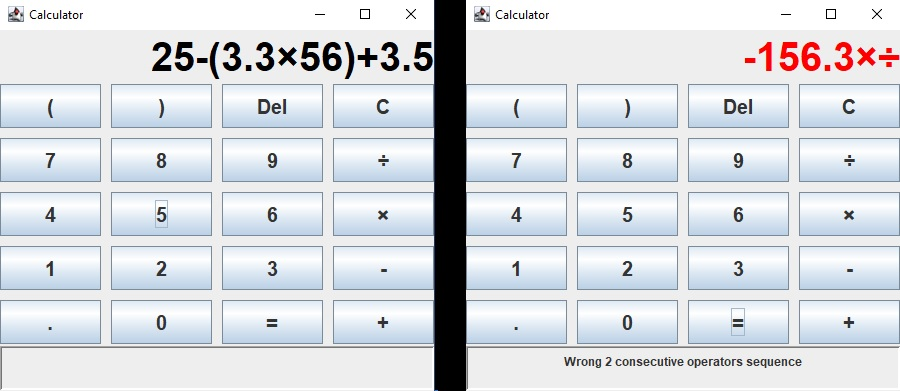

# Calculator

Java implementation of a simple calculator using:
* OpenJDK 25
* Java Swing library
* Maven 3.9.11

**Executable JAR is provided.**

### Features:
* Basic operations: addition, subtraction, multiplication, division (\u00D7, \u00F7).
* Parentheses support with standard operator precedence.
* Unary plus/minus (e.g., -2, +(3+4)).
* Decimal number support with input validation (rejects malformed numbers).
* Division-by-zero detection with user feedback.
* Visual validation feedback via status bar.

Internally, it performs infix-to-postfix expression conversion followed by postfix expression evaluation. It also provides visual feedback in case the input expression is ill-formed.

# Tests
Unit tested using JUnit 5.9.0

# How to run
#### Prerequisites:
* Java 16 or higher

1. Download the latest release zip from:\
   https://github.com/adam-choragwicki/Calculator_Swing_Java/releases/latest/download/Calculator_Swing_Java.jar

2. Run `java -jar Calculator_Swing_Java.jar`
